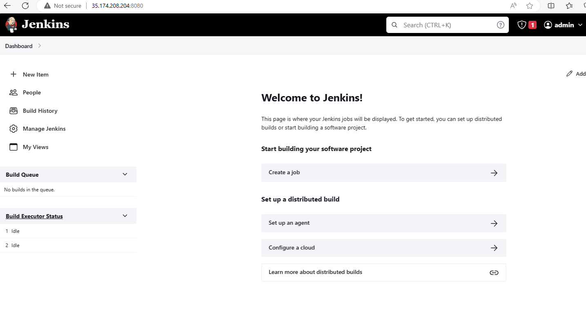
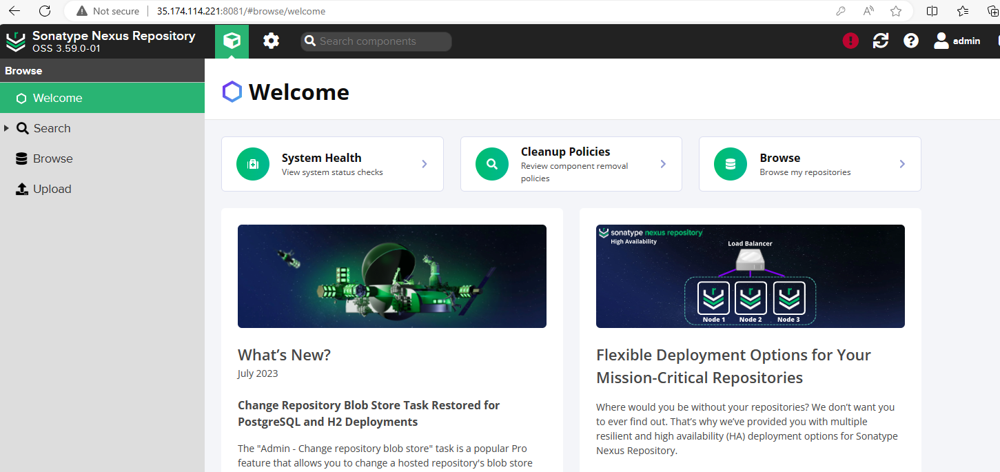
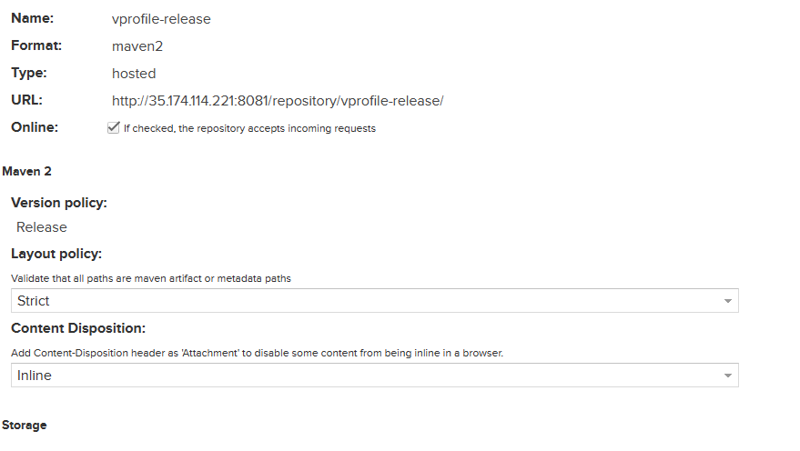
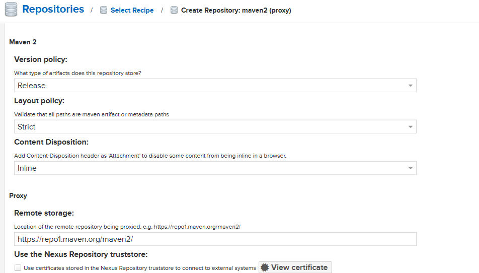
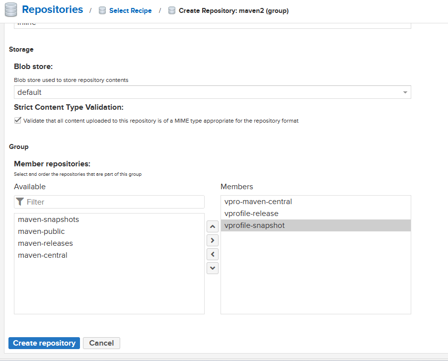
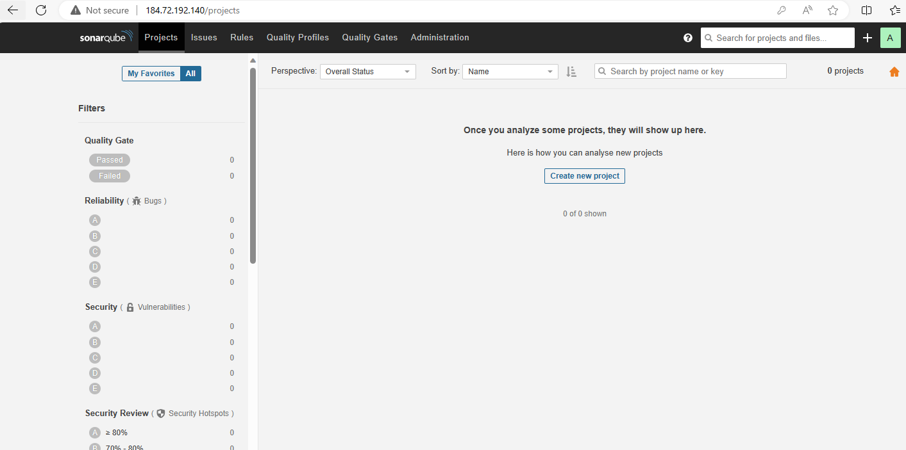
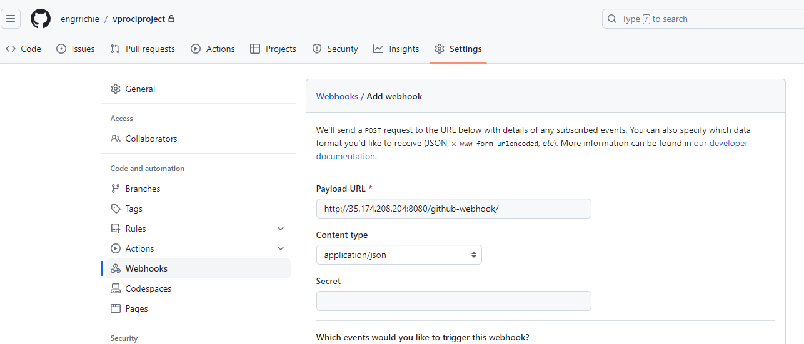
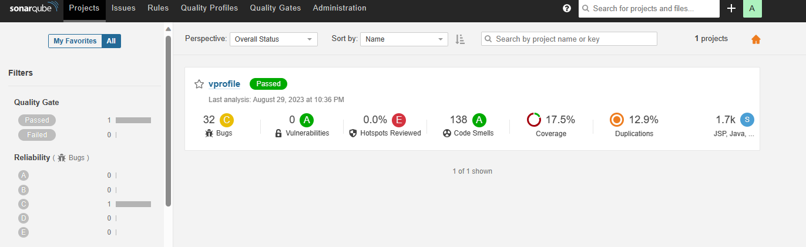
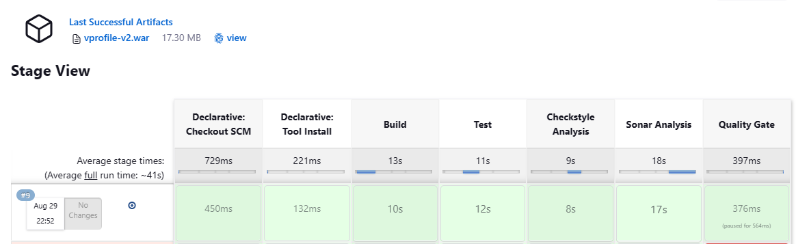

# Project-20: Continuous Delivery with Jenkins and Tools

[*Project Source*](https://www.udemy.com/course/devopsprojects/learn/lecture/23899708#overview)


### Prerequisites:
* AWS Account
* GitHub account
* Jenkins
* Nexus
* SonarQube
* Slack

### Step-1: Create Key-pair

- Create a keypair and download the private key to your local system. Make sure to remember where you downloaded your key. We will need this key to ssh our servers.
```sh
Name: vprofile-ci-key
```

### Step-2: Create Security Groups for Jenkins, Nexus and SonarQube

- Jenkins Sec-Grp
```sh
Name: jenkins-SG
Allow: SSH from MyIP
Allow: 8080 from Anywhere IPv4 and IPv6 (We will create a Github webhook which will trigger Jenkins)
```

- Nexus Sec-Grp
```sh
Name: nexus-SG
Allow: SSH from MyIP
Allow: 8081 from MyIP and Jenkins-SG
```

- SonarQube SecGrp
```sh
Name: sonar-SG
Allow: SSH from MyIP
Allow: 80 from MyIP and Jenkins-SG
```

- Once `sonar-SG` is created, add another entry to `jenkins Inbound rule` to Allow access on `8080` from `sonar-SG`. SonarQube will then send reports back to Jenkins.

### Step-3: Create EC2 instances for Jenkins, Nexus and SonarQube

## Jenkins Server Setup
- Create `Jenkins-server` with properties and userdata script below.
```sh
Name: jenkins-server
AMI: Ubuntu 20.04
SecGrp: jenkins-SG
InstanceType: t2.small
KeyPair: vprofile-ci-key
Additional Details: userdata below
```
- Jenkins Userdata script
```sh
#!/bin/bash
sudo apt update
sudo apt install openjdk-11-jdk -y
sudo apt install maven -y
curl -fsSL https://pkg.jenkins.io/debian-stable/jenkins.io.key | sudo tee \
  /usr/share/keyrings/jenkins-keyring.asc > /dev/null
echo deb [signed-by=/usr/share/keyrings/jenkins-keyring.asc] \
  https://pkg.jenkins.io/debian-stable binary/ | sudo tee \
  /etc/apt/sources.list.d/jenkins.list > /dev/null
sudo apt-get update
sudo apt-get install jenkins -y
###
```

## Nexus Server Setup
- Create `Nexus-server` with properties and userdata script below.
```sh
Name: nexus-server
AMI: Amazon Linux-2
InstanceType: t2.medium
SecGrp: nexus-SG
KeyPair: vprofile-ci-key
Additional Details: userdata below
```

- Nexus Userdata script
```sh
#!/bin/bash
yum install java-1.8.0-openjdk.x86_64 wget -y   
mkdir -p /opt/nexus/   
mkdir -p /tmp/nexus/                           
cd /tmp/nexus/
NEXUSURL="https://download.sonatype.com/nexus/3/latest-unix.tar.gz"
wget $NEXUSURL -O nexus.tar.gz
EXTOUT=`tar xzvf nexus.tar.gz`
NEXUSDIR=`echo $EXTOUT | cut -d '/' -f1`
rm -rf /tmp/nexus/nexus.tar.gz
rsync -avzh /tmp/nexus/ /opt/nexus/
useradd nexus
chown -R nexus.nexus /opt/nexus 
cat <<EOT>> /etc/systemd/system/nexus.service
[Unit]                                                                          
Description=nexus service                                                       
After=network.target                                                            
                                                                  
[Service]                                                                       
Type=forking                                                                    
LimitNOFILE=65536                                                               
ExecStart=/opt/nexus/$NEXUSDIR/bin/nexus start                                  
ExecStop=/opt/nexus/$NEXUSDIR/bin/nexus stop                                    
User=nexus                                                                      
Restart=on-abort                                                                
                                                                  
[Install]                                                                       
WantedBy=multi-user.target                                                      
EOT
echo 'run_as_user="nexus"' > /opt/nexus/$NEXUSDIR/bin/nexus.rc
systemctl daemon-reload
systemctl start nexus
systemctl enable nexus
```

## SonarQube Server Setup
- Create `sonar-server` with below properties and userdata script.
```sh
Name: sonar-server
AMI: Ubuntu 20.04
InstanceType: t2.medium
SecGrp: sonar-SG
KeyPair: vprofile-ci-key
Additional Details: userdata below
```
- Sonar Userdata script
```sh
#!/bin/bash
cp /etc/sysctl.conf /root/sysctl.conf_backup
cat <<EOT> /etc/sysctl.conf
vm.max_map_count=262144
fs.file-max=65536
ulimit -n 65536
ulimit -u 4096
EOT
cp /etc/security/limits.conf /root/sec_limit.conf_backup
cat <<EOT> /etc/security/limits.conf
sonarqube   -   nofile   65536
sonarqube   -   nproc    409
EOT
sudo apt-get update -y
sudo apt-get install openjdk-11-jdk -y
sudo update-alternatives --config java
java -version
sudo apt update
wget -q https://www.postgresql.org/media/keys/ACCC4CF8.asc -O - | sudo apt-key add -
sudo sh -c 'echo "deb http://apt.postgresql.org/pub/repos/apt/ `lsb_release -cs`-pgdg main" >> /etc/apt/sources.list.d/pgdg.list'
sudo apt install postgresql postgresql-contrib -y
#sudo -u postgres psql -c "SELECT version();"
sudo systemctl enable postgresql.service
sudo systemctl start  postgresql.service
sudo echo "postgres:admin123" | chpasswd
runuser -l postgres -c "createuser sonar"
sudo -i -u postgres psql -c "ALTER USER sonar WITH ENCRYPTED PASSWORD 'admin123';"
sudo -i -u postgres psql -c "CREATE DATABASE sonarqube OWNER sonar;"
sudo -i -u postgres psql -c "GRANT ALL PRIVILEGES ON DATABASE sonarqube to sonar;"
systemctl restart  postgresql
#systemctl status -l   postgresql
netstat -tulpena | grep postgres
sudo mkdir -p /sonarqube/
cd /sonarqube/
sudo curl -O https://binaries.sonarsource.com/Distribution/sonarqube/sonarqube-8.3.0.34182.zip
sudo apt-get install zip -y
sudo unzip -o sonarqube-8.3.0.34182.zip -d /opt/
sudo mv /opt/sonarqube-8.3.0.34182/ /opt/sonarqube
sudo groupadd sonar
sudo useradd -c "SonarQube - User" -d /opt/sonarqube/ -g sonar sonar
sudo chown sonar:sonar /opt/sonarqube/ -R
cp /opt/sonarqube/conf/sonar.properties /root/sonar.properties_backup
cat <<EOT> /opt/sonarqube/conf/sonar.properties
sonar.jdbc.username=sonar
sonar.jdbc.password=admin123
sonar.jdbc.url=jdbc:postgresql://localhost/sonarqube
sonar.web.host=0.0.0.0
sonar.web.port=9000
sonar.web.javaAdditionalOpts=-server
sonar.search.javaOpts=-Xmx512m -Xms512m -XX:+HeapDumpOnOutOfMemoryError
sonar.log.level=INFO
sonar.path.logs=logs
EOT
cat <<EOT> /etc/systemd/system/sonarqube.service
[Unit]
Description=SonarQube service
After=syslog.target network.target
[Service]
Type=forking
ExecStart=/opt/sonarqube/bin/linux-x86-64/sonar.sh start
ExecStop=/opt/sonarqube/bin/linux-x86-64/sonar.sh stop
User=sonar
Group=sonar
Restart=always
LimitNOFILE=65536
LimitNPROC=4096[Install]
WantedBy=multi-user.target
EOT
systemctl daemon-reload
systemctl enable sonarqube.service
#systemctl start sonarqube.service
#systemctl status -l sonarqube.service
apt-get install nginx -y
rm -rf /etc/nginx/sites-enabled/default
rm -rf /etc/nginx/sites-available/default
cat <<EOT> /etc/nginx/sites-available/sonarqube
server{
    listen      80;
    server_name sonarqube.groophy.in;
    access_log  /var/log/nginx/sonar.access.log;
    error_log   /var/log/nginx/sonar.error.log;
    proxy_buffers 16 64k;
    proxy_buffer_size 128k;
    location / {
        proxy_pass  http://127.0.0.1:9000;
        proxy_next_upstream error timeout invalid_header http_500 http_502 http_503 http_504;
        proxy_redirect off;
              
        proxy_set_header    Host            \$host;
        proxy_set_header    X-Real-IP       \$remote_addr;
        proxy_set_header    X-Forwarded-For \$proxy_add_x_forwarded_for;
        proxy_set_header    X-Forwarded-Proto http;
    }
}
EOT
ln -s /etc/nginx/sites-available/sonarqube /etc/nginx/sites-enabled/sonarqube
systemctl enable nginx.service
#systemctl restart nginx.service
sudo ufw allow 80,9000,9001/tcp
echo "System reboot in 30 sec"
sleep 30
reboot
```

### Step-4: Post Installation Steps

## For Jenkins Server:
ssh into jenkins server and check systemctl status. Get initial Admin password from directory `/var/lib/jenkins/secrets/initialAdminPassword`
```sh
sudo -i
system status jenkins
cat /var/lib/jenkins/secrets/initialAdminPassword
```

- Go to browser, `http://<public_ip_of_jenkins_server>:8080`, enter initialAdminPassword. Install suggested plugins.
- Install these plugins below for Jenkins.
```sh
Maven Integration
Github Integration
Nexus Artifact Uploader
SonarQube Scanner
Slack Notification
Build Timestamp
```


## For Nexus Server:

- ssh into your nexus server and check systemctl status for nexus.
```sh
sudo -i
system status nexus
```
- Go to browser,`http://<public_ip_of_nexus_server>:8081` ,click sign-in. Initial password will be located `/opt/nexus/sonatype-work/nexus3/admin.password`
```sh
cat /opt/nexus/sonatype-work/nexus3/admin.password
```

- Username is `admin`, paste password from previous step.
- Setup new password and select `Disable Anonymous Access`


- Select the gear symbol and create repository.

- This repo will be used to store our release artifacts.
```sh
maven2 hosted
Name: vprofile-release
Version policy: Release
```


- Next, create a `maven2 proxy` repository. Maven will store her dependencies in this repository, whenever we need any dependency for our project it will check this proxy repo in Nexus and download it for projects. Proxy repo will then download the dependencies from maven2 central repo.
```sh
maven2 proxy
Name: vpro-maven-central
remote storage: https://repo1.maven.org/maven2/
```


- This repo will be used to store our `snapshot` artifacts. That means any artifact with SNAPSHOT extension will be stored in this repository.
```sh
maven2 hosted
Name: vprofile-snapshot
Version policy: Snapshot
```


- Last repo, will be `maven2 group` type. We will use this repo to group all maven repositories.
```sh
maven2 group
Name: vpro-maven-group
Member repositories: 
 - vpro-maven-central
 - vprofile-release
 - vprofile-snapshot
```


### For SonarQube Server:

- Go to browser, `http://<public_ip_of_sonar_server>`.
Login with username admin and password admin.



### Step-5: Gitcode Migration

- Create a private repository in the Github to be used with this project.
- Copy the public ssh key and add it to your Github for authentication
```sh
ssh-keygen
cat ~/.ssh/id_rsa.pub
ssh -T git@github.com
```


- Create a directory and clone the source repo using the commands below
```sh
mkdir /c/projectgitrepo
cd /c/projectgitrepo
git clone -b ci-jenkins https://github.com/devopshydclub/vprofile-project.git
ls
mv vprofileproject vprociproject
ls
cd vprociproject/
```

- Replace the remote Git URL with the private  repository created
```sh
cat .git/config
git remote set-url origin git@github.com:engrrichie/vprociproject.git
cat .git/config
```


- Create branch main, then push both branch ci-jenkins and main to the private repository
```sh
git branch -c main
git checkout main
git checkout ci-jenkins
git push --all origin
```

- Integrate the Github repository with VScode
```sh
code .
```

### Step-6: Build Job with Nexus Repo

- First job will be to build Artifact from Source Code using Maven. JDK8 and Maven are to be installed in jenkins to successfully complete this job.
- Since the  application is using JDK8, we need to install Java8 in jenkins. `Manage Jenkins` -> `Global Tool Configuration` and install `JDK8` manually, and specify its PATH in here.
```sh
Under JDK -> Add JDK
Name: OracleJDK8
untick Install Automatically
JAVA_HOME: < we will get after next step >
```

- Currently our jenkins has JDK-11 install, SSH into jenkins server and install JDK-8. Then get the PATH to JDK-8 replaced " steps below". After installation JAVA_HOME for JDK-8 becomes `/usr/lib/jvm/java-8-openjdk-amd64`
```sh
sudo apt update -y
sudo apt install openjdk-8-jdk -y
sudo -i
ls /usr/lib/jvm
### we should get both jdk-11 and jdk-8 in this path ###
/usr/lib/jvm/java-1.8.0-openjdk-amd64
java-1.11.0-openjdk-amd64  java-11-openjdk-amd64  openjdk-11
java-1.8.0-openjdk-amd64   java-8-openjdk-amd64
```

- Next , setup Maven.
```sh
Name: MAVEN3
version : keep same
```

- Add Nexus login credentials to Jenkins. Go to `Manage Jenkins` -> `Manage Credentials` -> `Global` -> `Add Credentials`
```sh
username: admin
password: <pwd_setup_for_nexus>
ID: nexuslogin
description: nexuslogin
```

- Create Jenkinsfile for Build pipeline with code below.
```sh
pipeline {
    agent any
    tools {
        maven "MAVEN3"
        jdk "OracleJDK8"
    }
    environment {
        SNAP_REPO = 'vprofile-snapshot'
        NEXUS_USER = '<user_name>'
        NEXUS_PASS = '<password>'
        RELEASE_REPO = 'vprofile-release'
        CENTRAL_REPO = 'vpro-maven-central'
        NEXUSIP = '172.31.86.145'
        NEXUSPORT = '8081'
        NEXUS_GRP_REPO = 'vpro-maven-group'
        NEXUS_LOGIN = 'nexuslogin'
    }
    stages {
        stage('Build') {
            steps {
                sh 'mvn -s settings.xml -DskipTests install'
            }
        }
    }
}
```
- Create a new job in Jenkins with the properties below
```sh
Pipeline from SCM 
Git
URL: git@github.com:engrrichie/vprociproject.git
Crdentials: create github login credentials
#### add Jenkins credentials for github ####
Kind: SSH Username with private key
ID: githublogin
Description: githublogin
Username: git
Private key file: paste your private key here
#####
Branch: */ci-jenkins
path: Jenkinsfile
```

- Login jenkins server via SSH and complete the host-key checking step. Execute the command below, to store the identity of Github into the jenkins user `.ssh/known_hosts` file. This should clear the error.
```sh
sudo -i
su - jenkins
git ls-remote -h -- git@github.com:engrrichie/vprociproject.git HEAD
```


- Now its Build time.

- The build pipeline is successful!

### Step-7: Setup GitHub Webhook and update Jenkins Job

- In this step, we will add webhook to our github repository so whenever a new commit is made the build pipeline will be triggered automatically.
- Go to Github repository, `Settings` -> `Webhooks` -> Add ``JenkinsURL` with `/github-webhook/` at the end.


- Go to Jenkins and add the configuration below to `vprofile-ci-pipeline` .
```sh
Build Trigger: GitHub hook trigger for GITScm polling
```

- Add a post action to our pipeline script and commit/push changes to GitHub.
```sh
post {
                success {
                    echo "Now Archiving."
                    archiveArtifacts artifacts: '**/*.war'
                }
            }
        }

        stage('Test'){
            steps {
                sh 'mvn -s settings.xml test'
            }

        }

        stage('Checkstyle Analysis'){
            steps {
                sh 'mvn -s settings.xml checkstyle:checkstyle'
            }
        }
    }
}
```

- The job is triggered automatically after git push, and build is successful.


### Step-8: Code Analysis with SonarQube

- The Unit test/Code Coverage reports are generated under Jenkins workspace target directory, but these reports are not human readable.
- We need a tool that can scan/analyze the code and present it in a human readable format on our dashboard, SonarQube will be used for this.
* Set-Up These two Things:
- Sonar Scanner tool in Jenkins to scan the code
- SonarQube to enable Jenkins know where to upload the reports

- Lets start with Sonar Scanner tool configuration. Go to `Manage Jenkins` -> `Global Tool Configuration`
```sh
Add sonar scanner
name: sonarscanner
version: 4.7
```
- Go to Configure System, find theSonarQube servers section
```sh
tick environment variables
Add sonarqube
Name: sonarserver
Server URL: http://<private_ip_of_sonar_server>
Server authentication token: create token from sonar website
```

- Add the sonar token to global credentials.
```sh
Kind: secret text
Secret: <paste_token>
name: sonartoken
description: sonartoken
```
- Add SonarQube code to the pipeline and commit/push changes to GitHub.
```sh
##new environment variables to be added to environment##
SONARSERVER = 'sonarserver'
SONARSCANNER = 'sonarscanner'
##new stages to be added##
 stage('CODE ANALYSIS with SONARQUBE') {
          
          environment {
             scannerHome = tool "${SONARSCANNER}"
          }
          steps {
            withSonarQubeEnv("${SONARSERVER}") {
               sh '''${scannerHome}/bin/sonar-scanner -Dsonar.projectKey=vprofile \
                   -Dsonar.projectName=vprofile-repo \
                   -Dsonar.projectVersion=1.0 \
                   -Dsonar.sources=src/ \
                   -Dsonar.java.binaries=target/test-classes/com/visualpathit/account/controllerTest/ \
                   -Dsonar.junit.reportsPath=target/surefire-reports/ \
                   -Dsonar.jacoco.reportsPath=target/jacoco.exec \
                   -Dsonar.java.checkstyle.reportPaths=target/checkstyle-result.xml'''
            }
          }
```


- View quality gate results in SonarQube server.


- Next , create a Webhook in SonarQube to send the results analysis to jenkins.
```sh
http://<private_ip_of_jenkins>:8080/sonarqube-webhook
```
- Add the stage below to the pipeline and commit changes to Github.
```sh
stage('QUALITY GATE') {
            steps {
                timeout(time: 10, unit: 'MINUTES') {
               waitForQualityGate abortPipeline: true
            }
            }
}
```


### Step-9: Publish Artifact to Nexus Repo

- In this step, automate the process of publishing latest artifacts to the Nexus repository after a successful build.
- Build-Timestamp is added to artifact name to get unique artifact each time.
- Go to `Manage Jenkins` -> `Configure System` under `Build Timestamp` and update to preference.
```sh
yy-MM-dd_HHmm
```
- Add the stage below to your pipeline and view results.
```sh
stage('UPLOAD ARTIFACT') {
                steps {
                    nexusArtifactUploader(
                        nexusVersion: 'nexus3',
                        protocol: 'http',
                        nexusUrl: "${NEXUSIP}:${NEXUSPORT}",
                        groupId: 'QA',
                        version: "${env.BUILD_ID}-${env.BUILD_TIMESTAMP}",
                        repository: "${RELEASE_REPO}",
                        credentialsId: "${NEXUS_LOGIN}",
                        artifacts: [
                            [artifactId: 'vproapp' ,
                            classifier: '',
                            file: 'target/vprofile-v2.war',
                            type: 'war']
                        ]
                    )
                }
        }
```


### Step-10: Slack Notification

- Login to slack and create a workspace by following the prompts, then create a channel `jenkins-cicd` in the workspace.
- Next, add jenkins app to slack.
- Choose channel `jenkins-cicd`. It will give setup instructions, from there copy `Integration token credential ID` .
- Go to Jenkins dashboard Configure system -> Slack
```sh
Workspace:  vprofilecicd-5te8123 
credential: slacktoken 
default channel: #jenkins-cicd
```
- Add the sonar token to global credentials.
```sh
Kind: secret text
Secret: <paste_token>
name: slacktoken
description: slacktoken
```
- Add slack notification code and push the changes.
```sh
post{
        always {
            echo 'Slack Notifications'
            slackSend channel: '#jenkinscicd',
                color: COLOR_MAP[currentBuild.currentResult],
                message: "*${currentBuild.currentResult}:* Job ${env.JOB_NAME} build ${env.BUILD_NUMBER} \n More info at: ${env.BUILD_URL}"
        }
    }
```


- Notification from slack.


### Step-11: Setup Branches and Webhook

- Create a new branch from `ci-jenkins` branch and call it as `cicd-jenkins` branch.
```sh
cd c/vprociproject/
ls
git checkout ci-jenkins
git checkout -b cicd-jenkins
```

- Go to `docker` branch from the repository below and download as zip file, add it to your source code in your local repository for `cicd-jenkins` branch.
```sh
https://github.com/engrrichie/vprofileproject-all.git
```

- Create two new directories and copy Jenkinsfile to both Stage/Prod pipeline.
```sh
mkdir StagePipeline/ ProdPipeline/
cp Jenkinsfile StagePipeline/
cp Jenkinsfile ProdPipeline/
git rm Jenkinsfile
```
- Add the files and new branch to GitHub.
```sh
git add .
git commit -m "preparing cicd-jenkins branch"
git push origin cicd-jenkins
```

### Step-12: Setup IAM User & ECR

- Create IAM user named as `cicdjenkins` for jenkins with Programmatic access keys and add managed policies.
- Create Private ECR repository for Docker images named as `vprofileappimg`.

### Step-13: Jenkins Configurations

- Download the plugins below to Jenkins.
```sh
Docker Pipeline
CloudBees Docker build and Publish
Amazon ECR
Pipeline: AWS Steps
```
- Add AWS Credentials to Global Credentials of Jenkins, choose AWS Credentials and provide Access key and Secret key ID.
```sh
Credential : awscreds
Accesskey:
SecretAccessKey:
```
- Lastly, ssh into jenkins server and install docker. Follow documentation for installation steps Install Docker Engine on Ubuntu | Docker Docs and add Jenkins user into the Docker group using the below commands
```sh
sudo apt update && sudo apt install awscli -y

su - jenkins
usermod -aG docker jenkins
id jenkins
systemctl restart jenkins
```

### Step-14: Docker Build in Pipeline

- Add below env variables and stages to the `Jenkinsfile` under `StagePipeline` directory.
```sh
#### 3 new environment variables ####
         registryCredential = 'ecr:us-east-1:awscreds'
        appRegistry = '392530415763.dkr.ecr.us-east-1.amazonaws.com/vprofileappimg'
        vprofileRegistry = "https://392530415763.dkr.ecr.us-east-1.amazonaws.com"
################################
    stage('Build App image'){
            steps{
                script{
                  dockerImage = docker.build( appRegistry + ":$BUILD_NUMBER", "./Docker-files/app/multistage/")
                }
            }
        }
        stage('Upload App Image'){
            steps{
                script{
                    docker.withRegistry( vprofileRegistry, registryCredential ) {
                        dockerImage.push("$BUILD_NUMBER")
                        dockerImage.push('latest')
                    }
                }
            }
        }
```
- Commit/push changes to GitHub repository.

- Create a new pipeline in Jenkins.
```sh
Name: vprofile-cicd-pipeline-docker
Type: Pipeline
Build Trigger : GitSCM polling
Pipeline from SCM
URL : SSH url from GitHub
crdentials: githublogin
branch: cicd-jenkins
ScriptPath: StagePipeline/Jenkinsfile
```


### Step-15: AWS ECS Setup

- Create ECS Cluster for Staging environment.
```sh
Name: vproappstaging
Environment: Fargate 
```
- Create Task definition for app containers.
```sh
Name: vproappstagetask
containerName: vproapp
Port: 8080
Image URI: paste from ECR
Environment: Fargate 1 vCPU, 2 GB memory
```

- Create service .
```sh
Name:  vproappstagesvc
Replica: 1
task definition: vproappstagetask
LoadBalancer: create new (vproappstagelb)
target group vproappstagetg HTTP 80
secGrp: vproappstagesg
HTTP 80
Health check: /login
Grace period: 30
```
- Update port to `8080` in both `Target group` and `Security group`.
- The service is running, check app from browser using ELB URL.


### Step-16: Pipeline for ECS

- Add deploy stage to Jenkinsfile along with two new variables. Commit/push changes to GitHub and this should trigger our pipeline automatically.
```sh
###### new environment variables ####
cluster = "vprostaging"
service = "vproappstagesvc"
########################
stage('Deploy to ECS Staging') {
                steps {
                    withAWS(credentials: 'awscreds', region: 'us-east-1') {
                        sh 'aws ecs update-service --cluster ${cluster} --service ${service} --force-new-deploymnet'
                    }
                }
        }
```


### Step-17: Promote Code to Production

- Create a new ECS cluster for production.
```sh
Name: vproprod
Environment: Fargate
```
- Then create Task definition.
```sh
Name: vproprodtask
containerName: vproapp
Port: 8080
Image URI: paste from ECR
Environment: Fargate 1 vCPU, 2 GB memory
```

- Create service.
```sh
Name:  vproappprodsvc
Replica: 1
task definition: vproappprodtask
LoadBalancer: create new alb
name: vproappprodalb
target group vproappprodtg HTTP 80
secGrp: vproappprodsg
HTTP 80
Health check: /login
Grace period: 30
```

- Update port to `8080` in both `Target group` and `Security group`.
- Create a new branch from `cicd-jenkins` branch. Push new branch to GitHub.
```sh
git checkout -b prod
```
- Create new Jenkinsfile under ProdPipeline directory. Commit/push to GitHub.
```sh
def COLOR_MAP = [
    'SUCCESS' : 'good',
    'FAILURE' : 'danger'
]
pipeline {
    agent any
    environment {
        cluster = "vproprod"
        service = "vproappprodsvc"
    }
    stages{
        stage('Deploy to ECS Staging') {
                    steps {
                        withAWS(credentials: 'awscreds', region: 'us-east-1') {
                            sh 'aws ecs update-service --cluster ${cluster} --service ${service} --force-new-deployment'
                        }
                    }
            }
        }
    post{
        always {
            echo 'Slack Notifications'
            slackSend channel: '#jenkinscicd',
                color: COLOR_MAP[currentBuild.currentResult],
                message: "*${currentBuild.currentResult}:* Job ${env.JOB_NAME} build ${env.BUILD_NUMBER} \n More info at: ${env.BUILD_URL}"
        }
    }
}
```

- Create new pipeline job from Jenkins.

